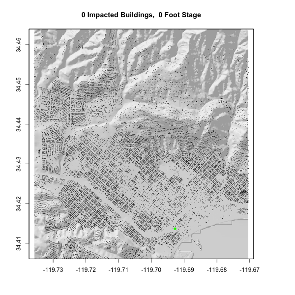

# Chi Zhang

# Raster&Remote Sensing

```{r setup, include=FALSE}
knitr::opts_chunk$set(warning = FALSE, message = FALSE, out.width = "75%", fig.align = 'center')

```

```{r, echo=FALSE}
library(tidyverse)
library(sf)
library(raster)
library(fasterize)
library(whitebox)

library(osmdata)
library(elevatr)
library(mapview)
```

```{r}
AOI = read_sf("https://labs.waterdata.usgs.gov/api/nldi/linked-data/nwissite/USGS-11119750/basin")

ele = elevatr::get_elev_raster(AOI, z = 13) %>%
  crop(AOI) 
  
ele1 = ele *3.281  
  
writeRaster(ele1, "data/basin-boundary.tif", overwrite = TRUE)

basin = raster("data/basin-boundary.tif")

osm1 = osmdata::opq(as.numeric(st_bbox(basin))) %>%
  add_osm_feature("building") %>%
  osmdata_sf()

poly = osm1$osm_polygons %>%
  st_centroid()

railway = poly %>%
  filter(amenity == "railway")

osm2 = osmdata::opq(as.numeric(st_bbox(basin))) %>%
  add_osm_feature("waterway", "stream") %>%
  osmdata_sf()

stream = osm2$osm_lines
  
cm1 = crop(basin, poly) %>%
  mask(poly)
cm2 = crop(basin, stream) %>%
  mask(stream)

```

```{r}
wbt_hillshade("data/basin-boundary.tif", "data/basin-boundary-hillshade.tif")

hillshade = raster("data/basin-boundary-hillshade.tif")

plot(hillshade, legend = FALSE, col = grey.colors(256, alpha = .5))


plot(basin, legend = FALSE)
plot(hillshade, add = TRUE, legend = FALSE, col = grey.colors(256, alpha = .5))
plot(cm2,add = TRUE)


river = stream %>%
  st_transform(5070) %>%
  st_buffer(10) %>%
  st_transform(crs(basin))

mask_r = fasterize::fasterize(river, basin, background = NA)


writeRaster(mask_r, "data/river-flowline.tif", overwrite = TRUE)

wbt_breach_depressions("data/basin-boundary.tif", "data/basin-boundary-conditionedDEM.tif")

wbt_elevation_above_stream("data/basin-boundary-conditionedDEM.tif", "data/river-flowline.tif", "data/river-HAND.tif")

hand = raster("data/river-HAND.TIF")
river_r = raster("data/river-flowline.tif")


hand_offset = hand + 3.69
hand_offset[hand_offset == 3.69] = 0

writeRaster(hand_offset, "data/river-hand-offset.tif", overwrite = TRUE)


```

```{r}
river_c = raster("data/river-hand-offset.tif")

flood = river_c
flood[flood >= 10.02] = NA

plot(hillshade, legend = FALSE, col = grey.colors(256, alpha = .5))
plot(flood, add = TRUE, col = palette(rev(blues9)))
plot(railway, add = TRUE, col = "green", cex = 1, pch = 16)
```

The map looks accurate with all provided data.

```{r}
buildings = extract(flood, poly)

#exsum(!is.na(buildings))

r_buildings = poly %>%
  mutate(flooded = buildings)

plot(hillshade, legend = FALSE, col = grey.colors(256, alpha = .5), 
     main = paste0(sum(!is.na(r_buildings$flooded)), " Impacted Buildings"))
plot(flood, add = TRUE, col = palette(rev(blues9)))
plot(r_buildings, add = TRUE, col = ifelse(!is.na(r_buildings$flooded), "red", "black"), pch = 16, cex = .08)
plot(railway, add = TRUE, col = "green", cex = 1, pch = 16)


```
```{r, eval=FALSE}
sb = AOI::aoi_get("Santa Barbara")

basin_sb = basin %>%
  crop(sb)


hillshade_sb = hillshade %>%
  crop(sb)


gifski::save_gif({
  for(i in 0:20) {
    hand_sb = river_c %>%
      crop(sb)
    hand_sb[hand_sb >= i] = NA
    
    building_sb = extract(hand_sb, poly)
    
    sb_building = poly %>%
      mutate(sb_flooded = building_sb)
    
    plot(hillshade_sb, legend = FALSE, col = grey.colors(256, alpha = .5), 
         main = paste0(sum(!is.na(sb_building$sb_flooded)), " Impacted Buildings,  ", i, " Foot Stage"))
    plot(hand_sb, add = TRUE, col = palette(rev(blues9)))
    plot(railway, add = TRUE, col = "green", cex = 1, pch = 16)
    plot(sb_building, add = TRUE, col = ifelse(!is.na(sb_building$sb_flooded), "red", "black"), pch = 20, cex = .08)
  }
}, gif_file = "data/mission-creek-fim.gif",
   width = 600, height = 600,
   delay = .7, loop = TRUE
)


```


